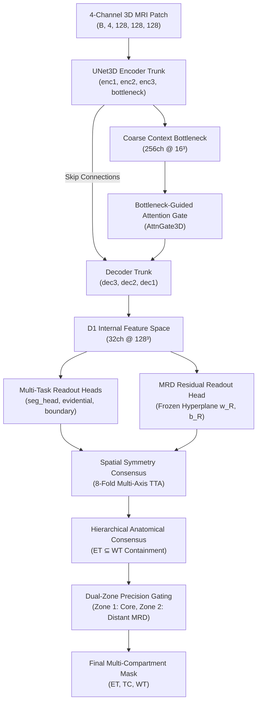
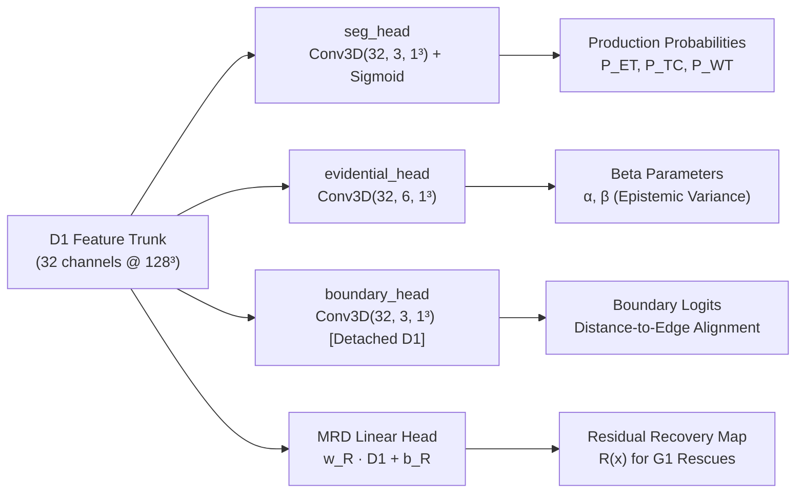
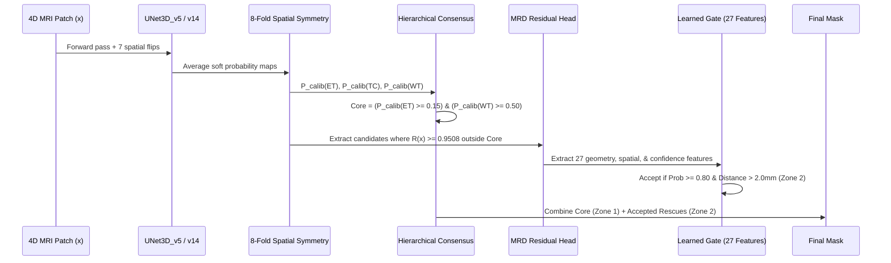

# NeuroScan 3D Model Architecture Documentation

This document provides a comprehensive technical reference for the neural network architectures, internal feature representations, readout mechanisms, and post-processing consensus pipelines used throughout the **NeuroScan** project for 3D multi-parametric brain tumor segmentation (BraTS).

---

## 1. High-Level Architecture Overview

NeuroScan processes 4-channel multi-parametric 3D MRI volumes:
1. **$T_1$-contrast enhanced ($T_1\text{c}$)**
2. **$T_1$-native ($T_1\text{n}$)**
3. **$T_2$-FLAIR ($T_2\text{f}$)**
4. **$T_2$-weighted ($T_2\text{w}$)**

The network predicts three overlapping tumor sub-compartments:
- **Enhancing Tumor (ET)**: Active, contrast-enhancing tumor tissue.
- **Tumor Core (TC)**: Enhancing tumor + necrotic/non-enhancing core ($\text{ET} \subseteq \text{TC}$).
- **Whole Tumor (WT)**: Tumor core + peritumoral edematous tissue ($\text{TC} \subseteq \text{WT}$).

---

## 2. Core Trunk Specifications: `UNet3D_v5`

`UNet3D_v5` is the primary production backbone architecture. It combines a 3D U-Net encoder-decoder structure with:
1. **Deep Supervision** at intermediate decoder resolutions ($D/4$ and $D/2$).
2. **Beta-Evidential Uncertainty Estimation** for epistemic confidence.
3. **Decoupled Boundary Gradient Branching**.
4. **Bottleneck-Conditioned Additive Attention Gating** on the finest skip connection (`enc1`).

### Detailed Layer-by-Layer Architecture

| Stage | Sub-Module / Layer | Operation & Kernel | In Channels | Out Channels | Output Resolution (for $128^3$ Input) |
| :--- | :--- | :--- | :---: | :---: | :---: |
| **Input** | `x` | Raw MRI voxel grid | 4 | 4 | $128 \times 128 \times 128$ |
| **Encoder 1** | `enc1[0]` | Conv3d ($3^3$, pad 1) + BN + ReLU | 4 | 32 | $128 \times 128 \times 128$ |
| | `enc1[1]` | Conv3d ($3^3$, pad 1) + BN + ReLU | 32 | 32 | $128 \times 128 \times 128$ |
| | `pool1` | MaxPool3d ($2^3$, stride 2) | 32 | 32 | $64 \times 64 \times 64$ |
| **Encoder 2** | `enc2[0]` | Conv3d ($3^3$, pad 1) + BN + ReLU | 32 | 64 | $64 \times 64 \times 64$ |
| | `enc2[1]` | Conv3d ($3^3$, pad 1) + BN + ReLU | 64 | 64 | $64 \times 64 \times 64$ |
| | `pool2` | MaxPool3d ($2^3$, stride 2) | 64 | 64 | $32 \times 32 \times 32$ |
| **Encoder 3** | `enc3[0]` | Conv3d ($3^3$, pad 1) + BN + ReLU | 64 | 128 | $32 \times 32 \times 32$ |
| | `enc3[1]` | Conv3d ($3^3$, pad 1) + BN + ReLU | 128 | 128 | $32 \times 32 \times 32$ |
| | `pool3` | MaxPool3d ($2^3$, stride 2) *(v5)* / `RAP` *(v14)* | 128 | 128 | $16 \times 16 \times 16$ |
| **Bottleneck**| `bottleneck[0]` | Conv3d ($3^3$, pad 1) + BN + ReLU | 128 | 256 | $16 \times 16 \times 16$ |
| | `bottleneck[1]` | Conv3d ($3^3$, pad 1) + BN + ReLU | 256 | 256 | $16 \times 16 \times 16$ |
| **Decoder 3** | `upconv3` | ConvTranspose3d ($2^3$, stride 2) | 256 | 128 | $32 \times 32 \times 32$ |
| | `cat3` | Concat(`upconv3`, `enc3`) | $128+128$ | 256 | $32 \times 32 \times 32$ |
| | `dec3[0]` | Conv3d ($3^3$, pad 1) + BN + ReLU | 256 | 128 | $32 \times 32 \times 32$ |
| | `dec3[1]` | Conv3d ($3^3$, pad 1) + BN + ReLU | 128 | 128 | $32 \times 32 \times 32$ |
| **Decoder 2** | `upconv2` | ConvTranspose3d ($2^3$, stride 2) | 128 | 64 | $64 \times 64 \times 64$ |
| | `cat2` | Concat(`upconv2`, `enc2`) | $64+64$ | 128 | $64 \times 64 \times 64$ |
| | `dec2[0]` | Conv3d ($3^3$, pad 1) + BN + ReLU | 128 | 64 | $64 \times 64 \times 64$ |
| | `dec2[1]` | Conv3d ($3^3$, pad 1) + BN + ReLU | 64 | 64 | $64 \times 64 \times 64$ |
| **Attention** | `attn_gate1` | Additive Attention Gating | $256 + 32$ | 32 | $128 \times 128 \times 128$ |
| **Decoder 1** | `upconv1` | ConvTranspose3d ($2^3$, stride 2) | 64 | 32 | $128 \times 128 \times 128$ |
| | `cat1` | Concat(`upconv1`, `enc1_gated`) | $32+32$ | 64 | $128 \times 128 \times 128$ |
| | `dec1[0]` | Conv3d ($3^3$, pad 1) + BN + ReLU | 64 | 32 | $128 \times 128 \times 128$ |
| | `dec1[1]` | Conv3d ($3^3$, pad 1) + BN + ReLU | 32 | 32 | $128 \times 128 \times 128$ |

---

## 3. Dedicated Mechanisms & Mathematical Formulations

### 3.1 AttentionGate3D (Bottleneck-Conditioned Skip Gating)

Unlike conventional Attention U-Nets where gating signals originate from the immediate preceding decoder stage ($D/2$), `UNet3D_v5` conditions gating on the **deepest bottleneck representation ($16^3$, 256 channels)** to directly guide the finest spatial skip ($128^3$, 32 channels).

$$\mathbf{g} = W_g * \mathbf{x}_{\text{bottleneck}}, \quad \mathbf{g} \in \mathbb{R}^{B \times 16 \times 16 \times 16 \times 16}$$

$$\mathbf{g}_{\text{up}} = \text{TrilinearInterpolate}(\mathbf{g}, \text{size}=\mathbf{x}_{\text{enc1}}), \quad \mathbf{g}_{\text{up}} \in \mathbb{R}^{B \times 16 \times 128 \times 128 \times 128}$$

$$\mathbf{x}_{\text{skip}} = W_x * \mathbf{x}_{\text{enc1}}, \quad \mathbf{x}_{\text{skip}} \in \mathbb{R}^{B \times 16 \times 128 \times 128 \times 128}$$

$$\psi = \sigma\left(W_\psi * \text{ReLU}(\mathbf{g}_{\text{up}} + \mathbf{x}_{\text{skip}})\right), \quad \psi \in [0, 1]^{B \times 1 \times 128 \times 128 \times 128}$$

$$\mathbf{x}_{\text{enc1\_gated}} = \mathbf{x}_{\text{enc1}} \odot \psi$$

- $W_g \in \mathbb{R}^{16 \times 256 \times 1 \times 1 \times 1}$ (bias-free Conv3d)
- $W_x \in \mathbb{R}^{16 \times 32 \times 1 \times 1 \times 1}$ (bias-free Conv3d)
- $W_\psi \in \mathbb{R}^{1 \times 16 \times 1 \times 1 \times 1}$ (Conv3d with bias)

---

### 3.2 Rank-Adaptive Pooling (RAP) in `UNet3D_v14`

In `UNet3D_v14`, `pool3` is replaced by Rank-Adaptive Pooling. Standard MaxPool discards 7 of 8 values per $2 \times 2 \times 2$ window. RAP measures the **Participation Ratio (Effective Rank)** $PR(w)$ of the 8 sub-voxel vectors in channel space:

$$PR(w) = \frac{\left(\text{Tr}(G_w)\right)^2}{\|G_w\|_F^2} = \frac{\left(\sum_{i=1}^8 \lambda_i\right)^2}{\sum_{i=1}^8 \lambda_i^2}, \quad G_w = V_w V_w^T \in \mathbb{R}^{8 \times 8}$$

- When $PR(w) \approx 1$, sub-voxels are collinear (redundant); max-pooling preserves all information.
- When $PR(w) \approx 8$, sub-voxels span mutually orthogonal directions; max-pooling discards essential features.

The adaptive pooling operator is:

$$y_w = (1 - a_w) \cdot \max(x_w) + a_w \cdot g(x_w)$$

$$a_w = \text{clip}\left(\lambda \cdot \sigma\left(s \cdot (PR(w) - \tau)\right), 0, 1\right)$$

- $g(x_w)$: Depthwise $2 \times 2 \times 2$ stride-2 convolution ($128 \times 1 \times 2 \times 2 \times 2$ weights).
- $\tau$: Learnable rank threshold (initialized at 1.45).
- $s$: Learnable sharpness factor ($\text{Softplus}(s_{\text{raw}})$, initialized at 4.0).
- $\lambda$: Learnable mixing scale (initialized at 0.05, with identity-at-init property).

---

## 4. Multi-Task Output Heads

All primary heads branch directly from the final internal feature representation:
$$\mathbf{D}_1 = \text{dec1.relu2\_out} \in \mathbb{R}^{B \times 32 \times D \times H \times W}$$

### 1. Primary Segmentation Head (`seg_head`)
$$\mathbf{P}_{\text{prod}} = \sigma\left(W_{\text{seg}} * \mathbf{D}_1 + \mathbf{b}_{\text{seg}}\right) \in [0, 1]^{B \times 3 \times D \times H \times W}$$
- Weight tensor: $W_{\text{seg}} \in \mathbb{R}^{3 \times 32 \times 1 \times 1 \times 1}$
- Bias vector: $\mathbf{b}_{\text{seg}} \in \mathbb{R}^3$
- Channel mapping: Channel 0 = ET, Channel 1 = TC, Channel 2 = WT.

### 2. Evidential Beta Head (`evidential_head`)
Computes conjugate Dirichlet / Beta parameters for evidential uncertainty quantification:
$$\mathbf{z}_{\text{evid}} = W_{\text{evid}} * \mathbf{D}_1 + \mathbf{b}_{\text{evid}} \in \mathbb{R}^{B \times 6 \times D \times H \times W}$$
$$\alpha = \text{Softplus}(\mathbf{z}_{\text{evid}}[:3]) + 1.0, \quad \beta = \text{Softplus}(\mathbf{z}_{\text{evid}}[3:]) + 1.0$$
$$\text{Expected Probability} = \frac{\alpha}{\alpha + \beta}, \quad \text{Epistemic Variance} = \frac{\alpha \beta}{(\alpha + \beta)^2 (\alpha + \beta + 1)}$$

### 3. Decoupled Boundary Head (`boundary_head`)
Supervises surface normals and boundary sharpness without allowing boundary gradients to destabilize volumetric representations:
$$\mathbf{z}_{\text{bnd}} = W_{\text{bnd}} * \text{detach}(\mathbf{D}_1) + \mathbf{b}_{\text{bnd}} \in \mathbb{R}^{B \times 3 \times D \times H \times W}$$

### 4. Deep Supervision Auxiliary Heads (`aux_head3`, `aux_head2`)
- `aux_head3`: Conv3D(128, 3, 1x1x1) + Sigmoid operating on `dec3` ($32^3$ resolution). Supervised against $4\times$ downsampled ground truth.
- `aux_head2`: Conv3D(64, 3, 1x1x1) + Sigmoid operating on `dec2` ($64^3$ resolution). Supervised against $2\times$ downsampled ground truth.

---

## 5. Pairwise Evidence Geometry & Missing Region Detection (MRD)

The core scientific discovery of the NeuroScan investigation is that the internal representation $\mathbf{D}_1$ preserves recoverable lesion signal that the single production hyperplane $\mathbf{w}_P$ fails to expose.

### 5.1 Orthogonal Hyperplane Geometry
Let $\mathbf{x} \in \mathbb{R}^{32}$ be the feature vector at voxel coordinate $(i, j, k)$:

$$\text{Production Logit: } z_P(\mathbf{x}) = \mathbf{w}_P^T \mathbf{x} + b_P$$

$$\text{MRD Residual Logit: } z_R(\mathbf{x}) = \mathbf{w}_R^T \mathbf{x} + b_R$$

The angle between the production decision vector and the residual recovery vector is approximately orthogonal:
$$\cos \theta = \frac{\mathbf{w}_P^T \mathbf{w}_R}{\|\mathbf{w}_P\|_2 \|\mathbf{w}_R\|_2} \approx 0.12 - 0.24$$

This orthogonality allows the residual readout to detect true lesion clusters ($G_1$ missed lesions) where $P_{\text{prod}}(\mathbf{x}) < 0.50$ without altering the primary network weights.

---

## 6. The Complete Inference & Post-Processing Pipeline

The final production inference pipeline integrates **Spatial Consensus Calibration**, **Hierarchical Containment**, and **Dual-Zone Candidate Gating**:

### 1. Spatial Symmetry Consensus (8-Fold TTA)
To eliminate orientation artifacts, the patch is evaluated across all combinations of reflections along axes $D, H, W$:
$$\bar{P}(x) = \frac{1}{8} \sum_{d \in \{0,1\}} \sum_{h \in \{0,1\}} \sum_{w \in \{0,1\}} \text{Flip}_{d,h,w}\left(\mathcal{M}\left(\text{Flip}_{d,h,w}(x)\right)\right)$$

### 2. Hierarchical Anatomical Consensus
Ground truth biology requires that Enhancing Tumor cannot exist outside the Whole Tumor envelope. Voxels are filtered by:
$$\text{Core}_{\text{ET}}(x) = \left(\bar{P}_{\text{ET}}(x) \ge 0.15\right) \land \left(\bar{P}_{\text{WT}}(x) \ge 0.50\right)$$

### 3. Dual-Zone Precision Gating
- **Zone 1 ($\le 2\text{ mm}$ Boundary Shell)**: Governed exclusively by the hierarchically calibrated core; raw candidate injection is blocked to prevent boundary dilation.
- **Zone 2 ($> 2\text{ mm}$ Distant Parenchyma)**: Governed by the pre-registered 27-feature logistic acceptance classifier ($A_2$), recovering isolated satellite lesions while rejecting false positive background artifacts.

---

## 7. Model Checkpoints & Execution Specs

| Model Tag | Checkpoint Path | Architecture Class | Training Loss | Best Mean Dice (Val) |
| :--- | :--- | :--- | :--- | :---: |
| **M1 (Production Base)** | `experiments/exp_e12_eggo_m/e131/runs/E131_v5control_seed0/checkpoints/best.pth` | `UNet3D_v5(4, 3)` | FocalTversky + Evidential + Boundary + Aux | **0.8929** |
| **M2 (Evidence Base)** | `experiments/exp_e12_eggo_m/e141/runs/E141_evidence_seed0/checkpoints/best.pth` | `UNet3D_v5(4, 3)` | Evidence-Weighted FocalTversky | **0.8922** |
| **M3 (RAP Base)** | `experiments/exp_e12_eggo_m/e131/runs/E131_v14_seed0/checkpoints/best.pth` | `UNet3D_v14(4, 3)` | Rank-Adaptive Pooling at Pool3 | **0.8942** |

### Computational Footprint
- **Parameters**: 5.72M (`UNet3D_v5`), 5.73M (`UNet3D_v14`)
- **Patch Dimension**: $128 \times 128 \times 128$ voxels (isotropic 1.0 mm spacing)
- **VRAM Consumption**: 4.62 GB during training (batch size 1, AMP enabled); 882 MB during evaluation.
- **Inference Speed**: ~0.05 seconds per single forward pass; ~3.4 seconds for 8-fold TTA on an NVIDIA RTX GPU.
